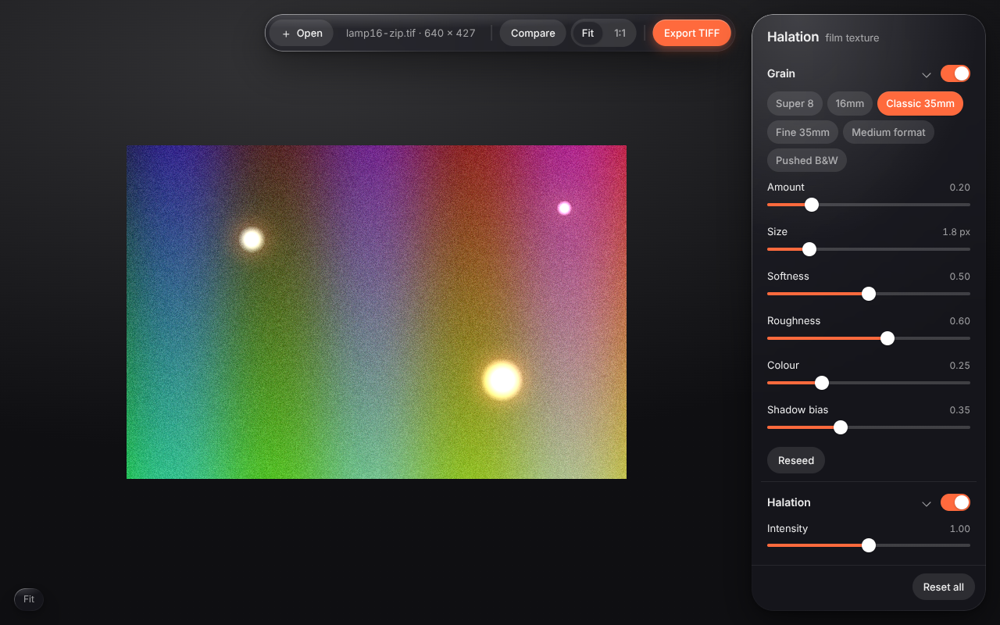

# Halation

Open-source film texture for **Adobe Lightroom Classic**: grain structures
(Super 8 to medium format), halation and bloom, and film damage (dust,
scratches, light leaks, vignette). A lightweight alternative to Dehancer that
does not try to recreate specific film stocks, just the physical texture of
film, with a minimalist UI inspired by Apple's Liquid Glass.



## How it works

Lightroom Classic is the only Lightroom with a plug-in SDK, and that SDK
(Lua) cannot draw custom UI or touch pixels on the GPU. So Halation follows
the same round-trip design Dehancer uses:

```
Lightroom Classic ──(Edit in Halation)──▶ plugin/Halation.lrplugin  (Lua)
      ▲                                       │ exports 16-bit TIFF + job.json
      │                                       ▼
      └── imports result, stacked ◀── app/  Halation editor (Tauri + WebGL2)
```

1. **Plug-in** (`plugin/Halation.lrplugin`): adds *Edit in Halation…* to
   *File ▸ Plug-in Extras* and *Library ▸ Plug-in Extras*. It renders the
   selected photos as 16-bit TIFFs with your develop settings baked in,
   writes a small job file, launches the editor and waits.
2. **Editor** (`app/`): a desktop app whose whole image pipeline runs in
   WebGL2 shaders. Preview and export go through the same shader, so what
   you see is what you get, with grain and glow sizes defined relative to
   the frame rather than the screen. It writes the result as a 16-bit TIFF
   next to the original (with the ICC profile carried over).
3. The plug-in imports every result into the catalog stacked under its
   source photo, exactly like Lightroom's own *Edit In*.

The editor also runs in a plain browser (open or drop a TIFF/JPEG/PNG,
export downloads a TIFF), which is how it is developed and tested without
Lightroom.

## Effects

| Section | Controls |
| --- | --- |
| **Grain** | Presets: Super 8, 16mm, Classic 35mm, Fine 35mm, Medium format, Pushed B&W. Amount, size (pixels at a 3000 px frame), softness, roughness (octave mix), colour, shadow bias, reseed. Procedural multi-octave value noise, applied in the encoded domain and weighted by a tone curve. |
| **Halation** | Intensity, radius (% of frame width), threshold, tint. Bright-pass in linear light, Gaussian blur, added back through a warm tint. |
| **Bloom** | Intensity, radius, threshold. Same extraction, neutral colour, wider radius. |
| **Damage** | Dust (density, size, light or dark specks), scratches (density, width), light leak (strength, direction, spread, colour), vignette (amount, feather), reseed. All procedural, resolution independent. |

Keyboard: hold `\` to compare with the original, `z` toggles Fit / 1:1,
`⌘O` open, `⌘E` export. Double-click a slider to reset it.

## Install

### Editor app

Download the bundle for your platform from the
[releases page](https://github.com/FlyingKangeroo/Halation/releases)
(`.dmg` for macOS, `.msi` or `.exe` for Windows). Bundles are not signed
yet, so macOS needs a right-click ▸ *Open* the first time. To build one
yourself:

```sh
cd app
npm install
npm run tauri build      # needs the Rust toolchain and Tauri's platform prerequisites
```

The bundle lands in `app/src-tauri/target/release/bundle/` (`.dmg`/`.app`
on macOS, `.msi`/NSIS `.exe` on Windows). Install it to `/Applications`
or the default per-user location on Windows; the plug-in looks there first.

Tauri prerequisites per platform are listed at
<https://v2.tauri.app/start/prerequisites/>.

### Lightroom plug-in

1. Lightroom Classic ▸ *File ▸ Plug-in Manager ▸ Add*.
2. Pick the `plugin/Halation.lrplugin` folder.
3. In the plug-in's settings, confirm the app location (or *Browse…* to it)
   and the hand-off colour space (sRGB is recommended; Adobe RGB and
   ProPhoto RGB are supported and round-trip with their ICC profile).

Select photos, then *File ▸ Plug-in Extras ▸ Edit in Halation…*. Tune the
look, press *Save to Lightroom*, and the edited TIFFs appear stacked with
the originals. With several photos selected, the editor shows a filmstrip
and applies the same settings to all of them on save.

## Development

```sh
cd app
npm install
npm run dev          # browser dev server on http://localhost:1420
npm run tauri dev    # same, inside the desktop shell
npm test             # TIFF codec unit tests (vitest)
npm run build && npm run test:e2e   # headless Chromium: loads a fixture, screenshots, exports, verifies the halo
```

Layout:

```
plugin/Halation.lrplugin/   Lua plug-in (Info.lua, round trip, settings panel)
app/src/engine/             WebGL2 pipeline, GLSL shaders, parameters and presets
app/src/io/                 TIFF decode/encode, image loading, Tauri/browser host bridge
app/src/ui/                 Liquid Glass controls and the editor shell (no framework)
app/src-tauri/              Tauri v2 shell: CLI args, file system and dialog plug-ins only
```

### Design notes

- **Resolution independence.** Grain pitch, glow radii, dust and scratches
  are all defined in frame units, so the preview at any zoom matches the
  full-resolution export.
- **Memory.** The source lives on the GPU as one half-float texture plus a
  half-resolution chain. Export renders in 256-row strips, so a 45 MP
  image never needs a full-size output buffer.
- **Colour.** Processing happens in linear light using the transfer curve
  of the hand-off space (sRGB curve, or gamma 2.2 / 1.8). No colour
  management beyond that; the ICC profile is copied from input to output
  so Lightroom interprets the result correctly.
- **UI.** Vanilla TypeScript and CSS. The glass material is
  `backdrop-filter: blur() saturate()` with a gradient specular rim and a
  lens sheen, which works in WebKit (macOS Tauri) and Chromium (Windows).

## Status and known gaps

- Lightroom Classic only. Lightroom (cloud) has no plug-in API; its
  *Edit In* menu can only launch apps registered as external editors.
- The Tauri shell is compiled by the release workflow
  (`.github/workflows/release.yml`) on macOS and Windows; it has not yet
  been run on a developer machine. The frontend, the shader pipeline, the
  TIFF codec and the Lightroom hand-off format are tested.
- Icons are placeholders.
- Images wider or taller than the GPU's maximum texture size (usually
  16384 px) are rejected with a message rather than tiled.

## Releasing

Pushing a `v*` tag runs the release workflow, which zips the plug-in,
builds the desktop app for macOS (Apple silicon and Intel) and Windows,
and attaches everything to a GitHub release. Notes are taken from
`docs/releases/<tag>.md` when that file exists.

```sh
git tag v0.1.0 && git push origin v0.1.0
```

## License

MIT.
